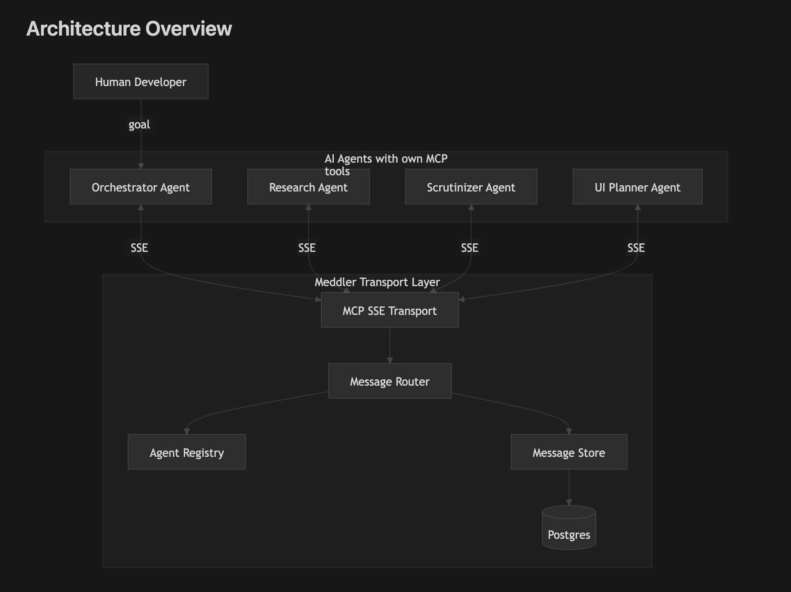
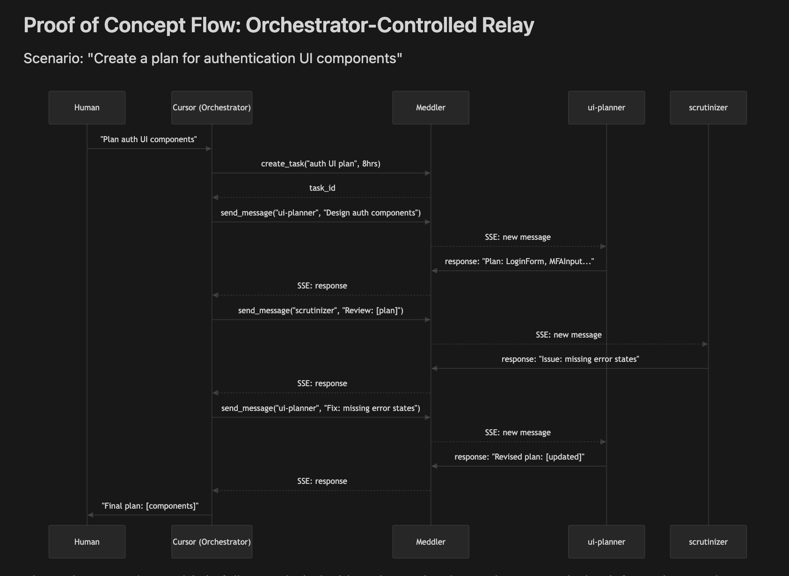

# Meddler

Meddler is a transport layer for AI agent orchestration. It lets a single orchestrator agent (running in your IDE via MCP) coordinate multiple specialized agents -- research, code review, UI planning, etc. -- by relaying messages between them. Agents never talk directly to each other; the orchestrator decides what information flows where and when, giving one actor full control over the entire workflow.





## Quick Start

```bash
# Start Postgres, Meddler server, and two mock agents
docker compose up
```

Cursor (`~/.cursor/mcp.json`):

```json
{
  "mcpServers": {
    "meddler": {
      "url": "http://localhost:3000/mcp/sse"
    }
  }
}
```

Zed (`settings.json`):

```json
{
  "context_servers": {
    "meddler": {
      "transport": "sse",
      "url": "http://localhost:3000/mcp/sse"
    }
  }
}
```

Any other MCP client -- use `http://localhost:3000/mcp/sse`.

Then ask your IDE:

> "Use meddler to send 'hello world' to the researcher agent"

## CLI Setup

Build and install the CLI for debugging:

```bash
cargo build --release -p meddler-cli
```

Add to `~/.zshrc`:

```bash
# Meddler CLI
export PATH="$PATH:$HOME/Developer/meddler/target/release"
```

Then from any terminal:

```bash
meddler list-agents
meddler send researcher "Hello!"
```

## MCP Tools

Tools available to the orchestrator:

| Tool | Description |
|------|-------------|
| `list_agents` | Discover available agents and their descriptions |
| `send_message` | Send a message to a specific agent by name |
| `get_messages` | Retrieve message history with optional filters |
| `create_task` | Create a task to group related messages |
| `get_task_status` | Check elapsed/remaining time on a task |

## Running with Real LLMs

Edit `docker-compose.yml` to connect agents to Ollama/LMStudio:

```yaml
researcher:
  image: meddler-agent:local
  environment:
    MEDDLER_URL: http://meddler:3000
    AGENT_NAME: researcher
    AGENT_DESC: "Research agent that searches and summarizes information"
    LLM_URL: http://host.docker.internal:11434/v1
    LLM_MODEL: qwen3:32b
```

Or run agents directly:

```bash
meddler agent \
  --name researcher \
  --desc "Research and summarization" \
  --llm-url http://localhost:11434/v1 \
  --model qwen3:32b
```

## Architecture

```
meddler/
├── crates/
│   ├── meddler-core/       # Types, traits, error handling
│   ├── meddler-store/      # Postgres persistence (sqlx)
│   ├── meddler-mcp/        # MCP protocol types and tool definitions
│   ├── meddler-server/     # Axum HTTP server
│   └── meddler-cli/        # CLI binary ("meddler")
├── migrations/             # SQL migrations
├── Dockerfile              # Multi-stage build (server + agent targets)
└── docker-compose.yml      # Full dev stack
```

## Development

```bash
# Run tests
cargo test

# Run clippy (pedantic lints enabled)
cargo clippy --all-targets

# Run docker compose
docker compose down
docker compose build --no-cache 
docker compose up 
```

## License

See [LICENSE](LICENSE).
